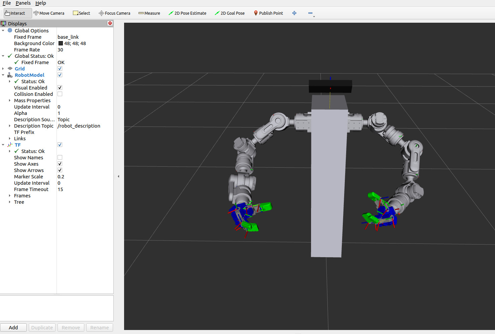

# bimanual_urdf
amber b1 arms + MX 28 hands

### amber b1 arm urdf 
https://github.com/raess1/amber_b1_arm

### robotiz MX 28 hands stp file
https://emanual.robotis.com/docs/kr/platform/robothand_mx28/

### ROBOT

